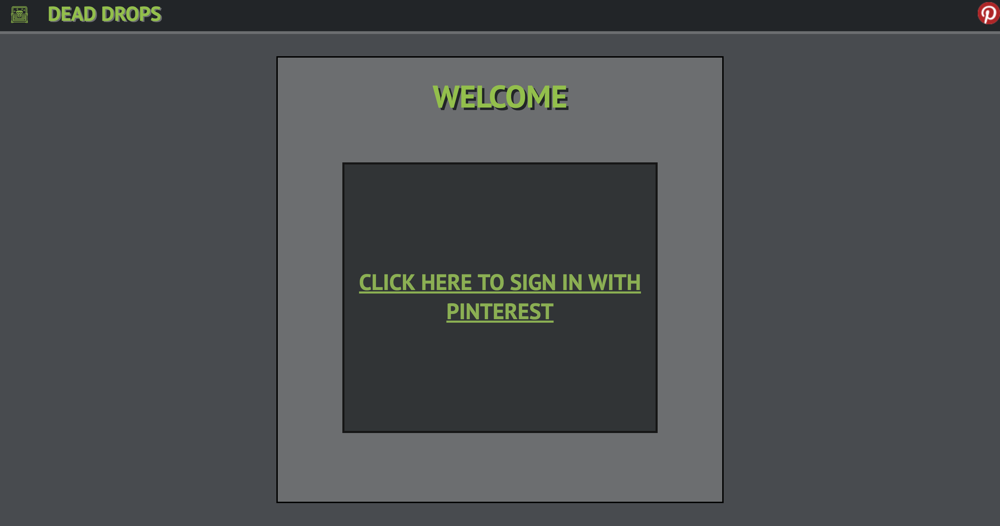
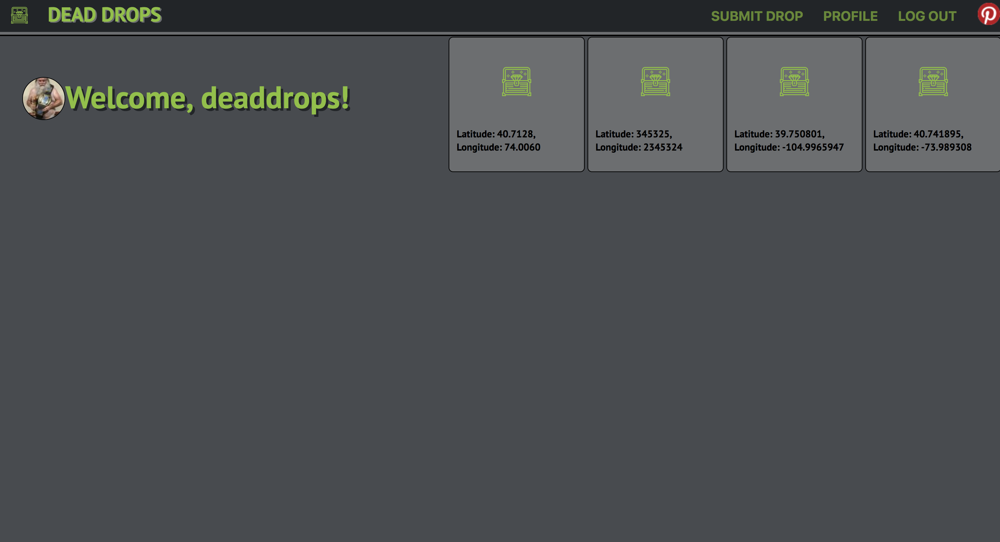
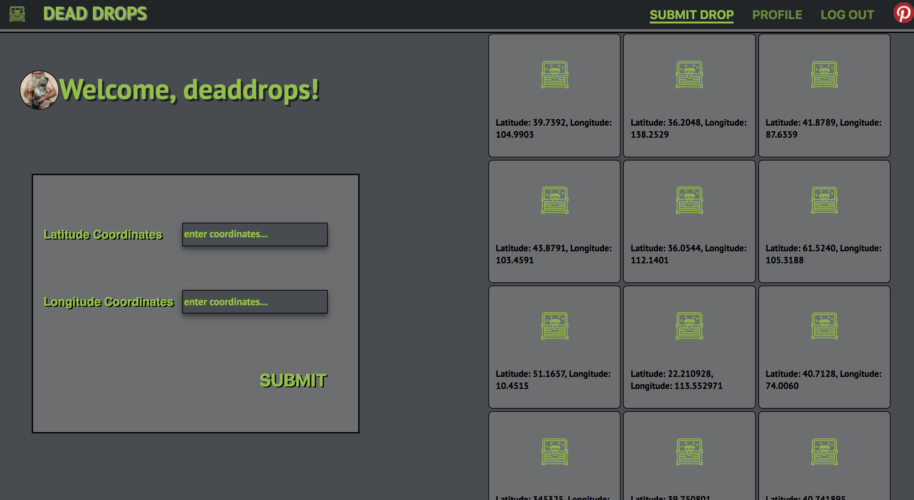
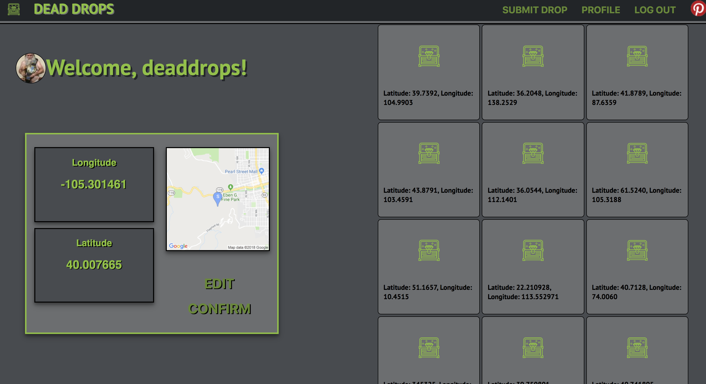

## Dead Drops

This project makes mulitple fetch calls utilizing the Pinterest and GoogleMaps APIs. The user is able to view the Dead-Drops board and post geocaching coordinates to it. This project uses the React-Redux library and React-Router. It is tested using the Jest and Enzyme libraries.

### Installation Instructions

* git clone https://github.com/TFisch/dead-drops
* cd dead-drops
* npm install
* npm start

### Application Navigation

From the home screeen a user may log in via Pinterest using OAuth2.0. They will be directed to their profile where they can see the current pins on the Dead Drops Board. By selecting "Submit A Drop" the user can submit a set of coordinates and a unique verification code which will post on the Pinterest board. A Google Maps image is rendered to confirm the selected location.

### Screenshots

  

  

  

